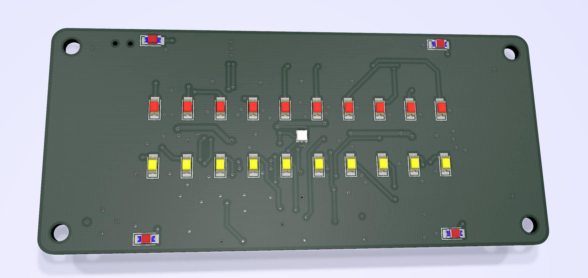
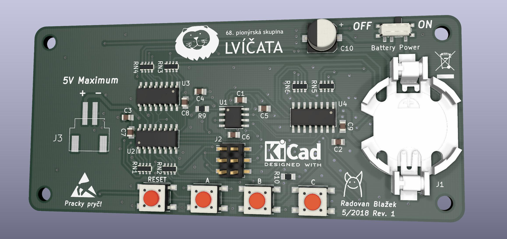
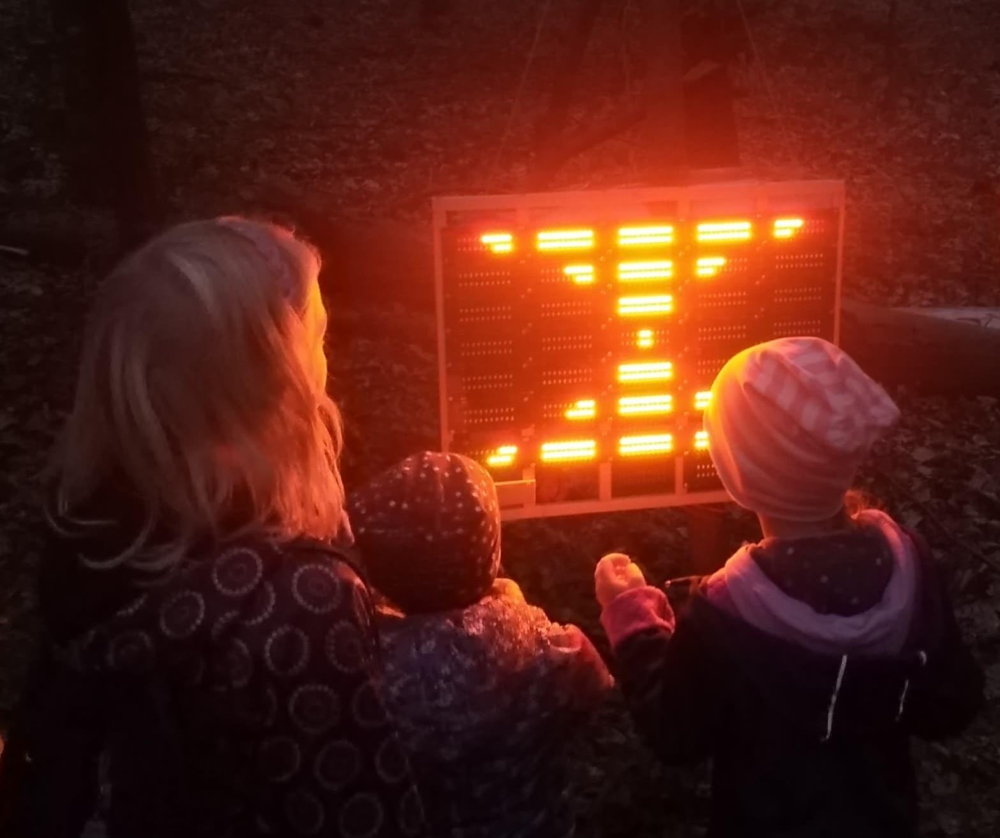

# Score Board

Originally designed for summer camp with a space theme. Boards were used to keep track of points kids got during the camp.

Features:
- ATtiny13A
- 2 rows of 10 LEDs in 1206 package
- 4 corner 1206 LEDs in 1206 package
- 1 center APA102-2020 RGB LED
- 3 general purpose buttons + reset
- Powered from JST XH 2 pin connector or on-board CR2032

Schematic: [hardware/score_board.pdf](hardware/score_board.pdf)

Example use-case:

